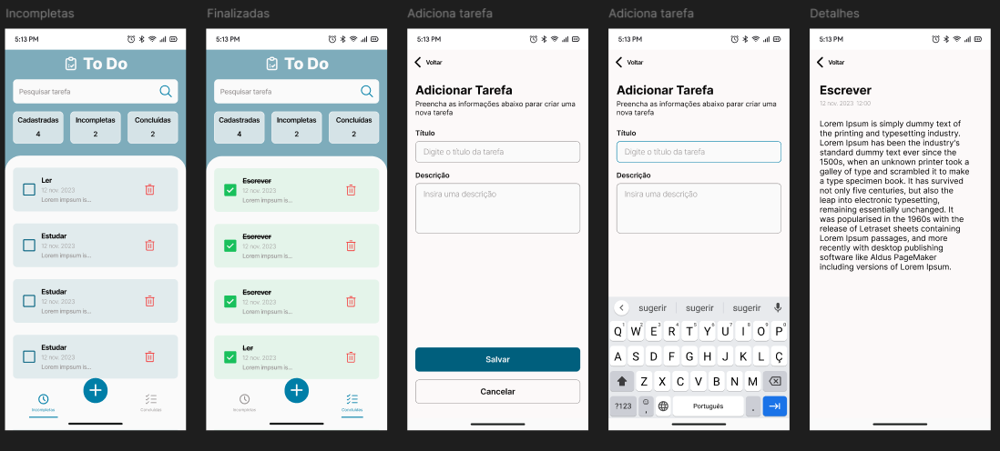

# 📝 To-Do App

Um aplicativo de lista de tarefas desenvolvido com **React Native**, **Expo** e **Styled Components**. Permite adicionar, visualizar, pesquisar e excluir tarefas.

## 📱 Capturas de Tela


## 🚀 Funcionalidades

- ✅ Adicionar tarefas
- 🔍 Pesquisar tarefas
- 📌 Listar tarefas pendentes e concluídas
- 🗑️ Excluir tarefas
- 🎨 Interface estilizada com **Styled Components**
- ⚡ Rápido e intuitivo

## 🛠️ Tecnologias Utilizadas

- [React Native](https://reactnative.dev/)
- [Expo](https://expo.dev/)
- [Styled Components](https://styled-components.com/)

## 📦 Como executar o projeto

### 1️⃣ Pré-requisitos

Certifique-se de ter instalado:

- **Node.js** (versão LTS recomendada)
- **Expo CLI** (instale com `npm install -g expo-cli`)
- **Expo Go** no seu dispositivo móvel (para testar)

### 2️⃣ Clonar o repositório

```sh
git clone https://github.com/brunamariap/to_do_list_mobile.git
```

### 3️⃣ Instalar dependências
```sh
npm install
# ou
yarn install
```

4️⃣ Rodar o app
```sh
npx expo start
```
